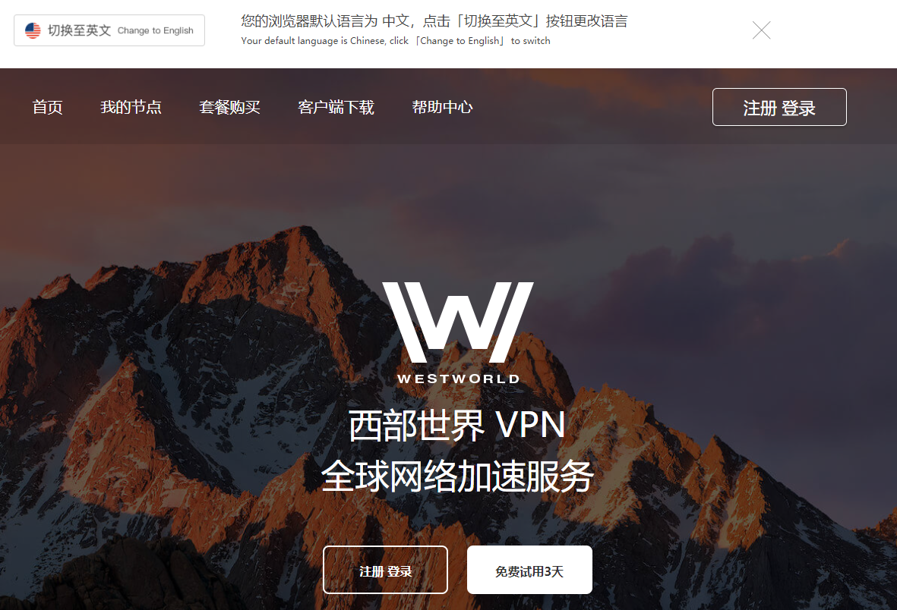
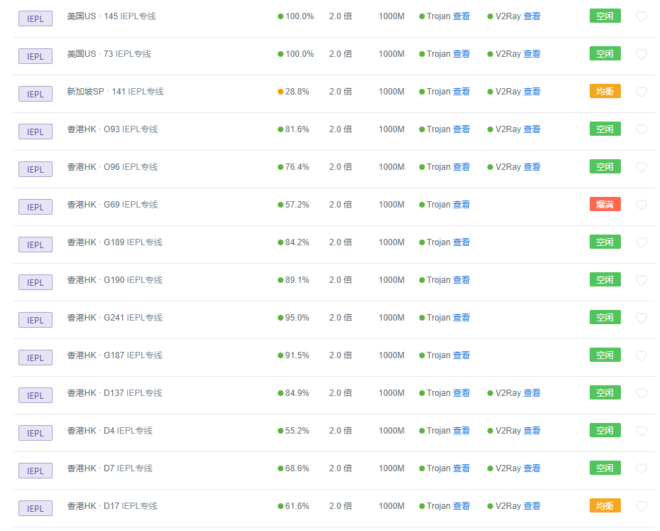
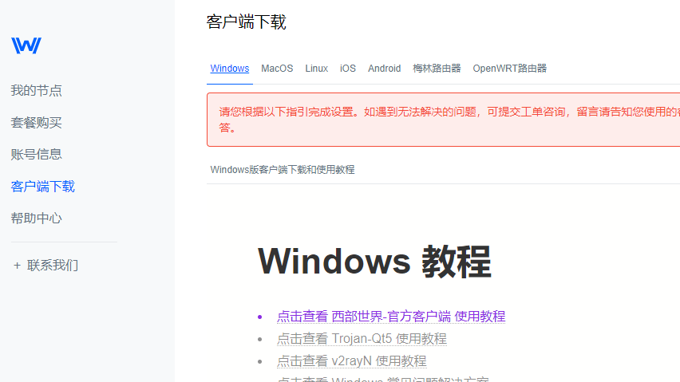
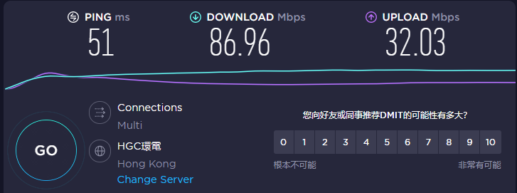
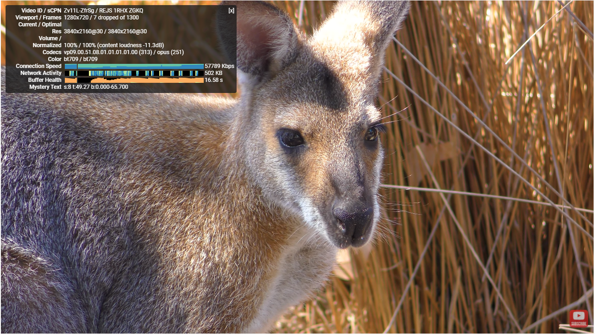

# 分享一个比较好的翻墙方法和翻墙软件，手机电脑都能用的翻墙工具

### 这是一篇关于翻墙方法的文章，对于很多朋友来说，比如查查资料，休闲娱乐，有时候都需要访问国外的网络，翻墙就是一个硬性的需求，但是又有好多朋友还不会翻墙，什么去上海自贸区或者去香港这类的肉身翻墙方法就不说了，这里统一说一下实践门槛比较低的翻墙方法，那就是下载一个翻墙软件。

我自己比较常用的翻墙软件是Westworld这款，翻译成中文就是西部世界，这款翻墙软件足够解决大多数人的翻墙需求。

能翻墙的梯子软件我们一般都称之为梯子，对于梯子的要求，无非也就是网络稳定，品牌靠谱，网速足够快等等这几点要求，对于这几点，这款软件基本都能够满足。

## 翻墙梯子网站：[点击访问翻墙梯子](https://xbsj4621.fun/i/ask049)

这款软件手机和电脑都是可以使用的，方法很简单，登录他们的网站，注册之后，点击网站左上角的客户端下载选项，然后选择对应的客户端版本下载安装就行，下载界面还有详细的视频和图文教程，就算0基础的新手也能很快学会。

如果你用的是电脑，那就下载windows或者mac版本的客户端，如果用的是苹果手机想要翻墙上外网，那就下载ios客户端，安卓手机就下载Andriod客户端。

观看视频和图文教程两三分钟，下载安装也就两三分钟，算下来十分钟不到，就可以开始畅游国外的网络了。

太复杂的东西就不介绍了，这款翻墙梯子软件所有的节点线路都是用的IEPL专线，所以不存在用网高峰期的网络拥堵情况，全天24小时随时上网，网络是都很快很畅通的。而且网站的上网节点很丰富，将近100条左右，随便选择任意的节点都能获得很快的上网感受。

也就是说不管是翻墙访问Youtube/ins/pornhub/推特还是什么，不管是浏览视频还是图片，都能够做到秒缓冲，并且全程保持高网速，就算是要打外服游戏，这款梯子软件也是提供游戏专用节点的，延迟很低，完全不会造成游戏过程中的卡顿现象。

目前软件的价格有免费，月费和年费三种档次，月费25RMB，年费188RMB，免费线路是给新注册用户试用的，用来降低用户的试错成本，可以体验觉得合适之后，再进行付费线路的购买，当然付费线路的网速和带宽是要高于免费线路的。

软件的详细信息放在下面，如果对于[翻墙方法](https://github.com/gelangtai/fanqiang)有需求的小伙伴，可以用这款软件，真的好用。

**软件官网截图：**

**线路列表截图：**

**客户端下载页截图：**

**SpeedTest测试结果截图：**

**Youtube 4k超高清视频测速：**

